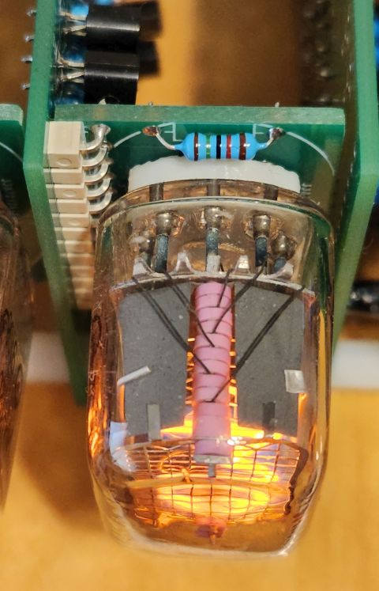

# T-Clock: A Nixie tube clock build from transistors only

The first working transistor demo just had its 75th aniversary: https://en.wikipedia.org/wiki/History_of_the_transistor How to better celebrate it than having (103 times) fun with transistors? Some time back I discovered in the German magazin Funkschau 1969 #2, #2 and #10 the article "Digital-Uhr zum Selbstbau", a copy of it can be found here: http://www.nixieuhren.de/downloads/digitaluhrfunkschau.pdf It is an Nixie clock design completly based on transistors. I always wanted to build one of these. When I found out that Kicad supports auto routing (freeRouting/LayoutEditor), that became much more feasible. This repository contains the PCB designs as well as OpenScad designs for the case and the spacer for the Nixies.

** Warning: Nixie tubes require high voltages which can be lethal. Please be careful! **

## Changes compared to the original

### Prescaler

I'm living in US, so I had to modify the prescaler from 50Hz to 60Hz mains frequency. /60 can be very easy implemented as /10 followed by /6. This allowed to re-use the PCBs of the first and second digit, just the decoding/high voltage transistors aren't populated on these PCBs. Luckyly the usual PCB prototype manufactures always send a couple of copies of each ordered PCB, very handy for that.

### Schmitt-Trigger

The Schmitt trigger for converting the sinusodial mains signal to an square wave feeding the prescaler was converted from Ge to Si. Because the circuit is small, I didn't develop an pcb for it but implemented it on a piece of perfboard. 

### Power Supply

Power source is an 12VAC 1.5A wall wart, this way no routing of mains voltage is needed. The high voltage for the Nixie tubes is generated by a small reverse operated transformer. Because of the high DC resistance of the transformer the supply is very soft and reaching the correct voltage (about 170V) is a bit critical. Therfore the rectified 12V was added in order to reach the required voltage. If this is needed or not will depend on the type of transformer. The Ge transistors of the 12V regulator were replaced by Si ones. The pass transistor needs an heatsink. A perfboard was used for the power supply. 

## Obtaining the parts

All components are easily obtainable except for the Nixie tubes. The IN-12 Nixie tube can still be found on ebay. Because the decimal point isn't used, both the A and B version will work fine.

## Mechanical

### Boards

The boards are stacked with 25mm M3 spacers and 10mm M3 spacers. The stack will be mounted to the case.

### Nixie

Even more difficult to source than the Nixie tubes are sockets for them. Therefore I soldered the Nixie tubes directly to the PCB. I've seen this methode first in Russian test equipment offered on an flea market. For equally spacing the Nixie from the PCB an 3d printed spacer is used (in12b.scad).  

### Case

TBD